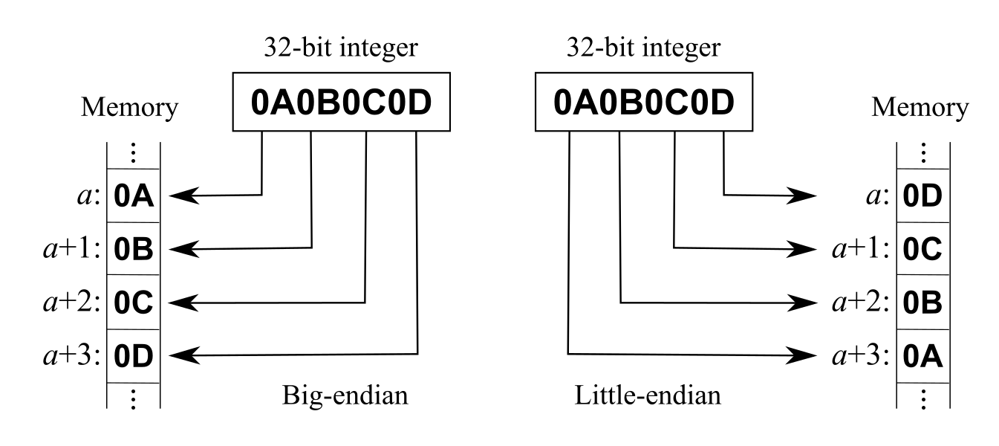

## About Pokemon Poke Ball Plus

* The Nintendo [Poke Ball Plus](https://www.pokemon.com/us/pokemon-video-games/poke-ball-plus) (PBP) is a controller and accessory for the Nintendo Switch and for the Pokemon GO mobile game
* Doubles as a Pokemon GO accessory, where it replaces a [Pokemon GO Plus](porygon.md)
* Uses Bluetooth Low Energy (BLE) for the Pokemon GO mode, and Nintendo's HID based protocol for the Switch
* Has an analog stick with an integrated push button, a second top button, a RGB LED, a speaker and a vibration motor
* Has an accelerometer and a gyroscope
* An internal rechargeable Li-ion battery is used as power source

## Hardware

* CPU: Cypress CYW20734 (Bluetooth 4.1)
* 6 axis IMU, accelerometer and gyroscope
* 220 mAh lipo battery, rechargeable over USB-C

## Features

* RGB LED, speaker and vibration
* Analog stick and two buttons press
* Accelerometer
* Gyroscope
* Battery level

## Protocol

The device exposes two unrelated personalities over BLE.

The **gamepad** service is open: subscribing to its notification characteristic starts a
stream of stick, button, accelerometer and gyroscope samples, with no authentication of any kind.

The **Pokemon GO** side reuses the exact same services as the Pokemon GO Plus, including the certificate service,
and is subject to the same certification handshake and the same per device key requirement. See [porygon.md](porygon.md).

### BLE & GATT

The basic technologies behind the communication are [Bluetooth Low Energy (BLE)](https://en.wikipedia.org/wiki/Bluetooth_Low_Energy) and [GATT](https://www.bluetooth.com/specifications/gatt).
They allow the devices and the app to share data in a defined manner and define the way you can discover the devices and their services.
In general you have to know about services and characteristics to talk to a BLE device.



### Data structure

Bluetooth payload data typically uses little-endian byte order.
This means that the data is represented with the least significant byte first.

The gamepad payload mixes conventions: the motion values are regular little-endian signed 16 bits integers,
but the stick X axis is split across two nibbles of two consecutive bytes, a Joy-Con inheritance.

## Advertisement data

Once the device is powered on by clicking one of its buttons, it will advertise for about 10 seconds.

##### Service data, UUID `0x0000`

1 byte, `0x00`.

##### Manufacturer data, company ID `0x0553` (Nintendo Co. Ltd.)

15 bytes, for example `0x01adde00efbe000000000000000000`.

| Position | 00 | 01 | 02 | 03 | 04 | 05 | 06 | 07 | 08 | 09 | 10 | 11 | 12 | 13 | 14 |
| -------- | -- | -- | -- | -- | -- | -- | -- | -- | -- | -- | -- | -- | -- | -- | -- |
| Value    | 01 | ad | de | 00 | ef | be | 00 | 00 | 00 | 00 | 00 | 00 | 00 | 00 | 00 |

| Bytes | Type      | Value  | Description                          |
| ----- | --------- | ------ | ------------------------------------ |
| 00    | uint8     | 1      | payload type or version              |
| 01-02 | uint16_le | 0xdead | ?                                    |
| 03-05 | ?         | 0xbeef | ?                                    |
| 06-14 | ?         | 0      | padding                              |

The `dead` / `beef` values are placeholders left in the firmware rather than real data.  
The same bytes appear again, prefixed with the company ID, in the read only characteristic `addc3e26-4aa5-4c1a-8a6a-735db4e01c70`.  

## Services and characteristics

The name advertised by the device is `Pokemon PBP`, and its MAC address belongs to the `Nintendo Co. Ltd.` range.

##### Generic access (UUID 00001800-0000-1000-8000-00805f9b34fb)

| Characteristic UUID                  | Access      | Description                         |
| ------------------------------------ | ----------- | ----------------------------------- |
| 00002a00-0000-1000-8000-00805f9b34fb | read        | device name                         |
| 00002a01-0000-1000-8000-00805f9b34fb | read        | appearance                          |

##### Generic attribute (UUID 00001801-0000-1000-8000-00805f9b34fb)

| Characteristic UUID                  | Access      | Description                         |
| ------------------------------------ | ----------- | ----------------------------------- |
| 00002a05-0000-1000-8000-00805f9b34fb | read/indic. | service changed                     |

##### Battery service (UUID 0000180f-0000-1000-8000-00805f9b34fb)

| Characteristic UUID                  | Access      | Description                         |
| ------------------------------------ | ----------- | ----------------------------------- |
| 00002a19-0000-1000-8000-00805f9b34fb | read        | battery level                       |

##### Device information (UUID 0000180a-0000-1000-8000-00805f9b34fb)

| Characteristic UUID                  | Access      | Description                         |
| ------------------------------------ | ----------- | ----------------------------------- |
| 00002a29-0000-1000-8000-00805f9b34fb | read        | manufacturer name string            |
| 00002a28-0000-1000-8000-00805f9b34fb | read        | software revision string            |

##### Gamepad service (UUID 6675e16c-f36d-4567-bb55-6b51e27a23e5)

| Characteristic UUID                  | Access          | Description                     |
| ------------------------------------ | --------------- | ------------------------------- |
| 6675e16c-f36d-4567-bb55-6b51e27a23e6 | read/notify     | input report (stick, buttons, motion) |
| 6675e16c-f36d-4567-bb55-6b51e27a23e7 | write no resp.  | output report (LED, rumble, speaker) |
| 6675e16c-f36d-4567-bb55-6b51e27a23e8 | read/notify/ind.| status                          |

##### Device identity service (UUID addc3e26-4aa5-4c1a-8a6a-735db4e01c6c)

| Characteristic UUID                  | Access          | Description                     |
| ------------------------------------ | --------------- | ------------------------------- |
| addc3e26-4aa5-4c1a-8a6a-735db4e01c6d | write no resp.  | ?                               |
| addc3e26-4aa5-4c1a-8a6a-735db4e01c6e | write           | ?                               |
| addc3e26-4aa5-4c1a-8a6a-735db4e01c6f | read            | device Bluetooth address        |
| addc3e26-4aa5-4c1a-8a6a-735db4e01c70 | read            | advertisement payload           |
| addc3e26-4aa5-4c1a-8a6a-735db4e01c71 | read/notify/ind.| ?                               |

##### Pokemon GO services

See [porygon.md](porygon.md)

The device also exposes the two Pokemon GO Plus services, with the same UUIDs and, as far as we know, the same behaviour:

| Service UUID                         | Description                            |
| ------------------------------------ | -------------------------------------- |
| bbe87709-5b89-4433-ab7f-8b8eef0d8e37 | certificate service                    |
| 21c50462-67cb-63a3-5c4c-82b5b9939aeb | device control service, LED and button |

##### Others

Two further services are advertised, but not much is known about them.

| Service UUID                         | Description                            |
| ------------------------------------ | -------------------------------------- |
| 2bbe7f7c-7304-4466-8407-8eaf89f8ce45 | ?                                      |
| c7261110-f425-447a-a1bd-9d7246768bd8 | ?                                      |

## Certification process

See [porygon.md](porygon.md).  

The certificate service is shared with the Pokemon GO Plus, and gates the Pokemon GO specific features only.
The main problem is that **keys are not extractables**, because there are no tools like the [SUOTA Go+](https://github.com/Jesus805/Suota-Go-Plus) available for this device...

The gamepad service is usable without it.

## Using the device

#### Device name

A read request to the `device name` characteristic will return 11 bytes of data, for example `0x506f6b656d6f6e20504250`.

| Position | 00 | 01 | 02 | 03 | 04 | 05 | 06 | 07 | 08 | 09 | 10 |
| -------- | -- | -- | -- | -- | -- | -- | -- | -- | -- | -- | -- |
| Value    | 50 | 6f | 6b | 65 | 6d | 6f | 6e | 20 | 50 | 42 | 50 |

| Bytes | Type          | Value         | Description                           |
| ----- | ------------- | ------------- | ------------------------------------- |
| all   | ASCII text    | Pokemon PBP   | device name                           |

#### Device appearance

The `appearance` characteristic reads `0x03c0`, which is the standard `Human Interface Device / Gamepad` value.

#### Software revision

A read request to the `software revision string` characteristic will return 17 bytes of data, for example `0x31382e3020202020204543354132424631`.
                        
| Bytes | Type          | Value         | Description                           |
| ----- | ------------- | ------------- | ------------------------------------- |
| 00-08 | ASCII text    | `18.0    `    | firmware version, space padded        |
| 09-16 | ASCII text    | EC5A2BF1      | build identifier                      |

The `manufacturer name string` characteristic reads `Nintendo`.

#### Device address

A read request to the `device Bluetooth address` characteristic will return the 6 bytes of
the device address, in display order, for example `0x9458cba0561c` for `94:58:CB:A0:56:1C`.

#### Battery level

A read request to the `battery level` characteristic will return 1 byte of data, for example `0x4b`.

| Bytes | Type          | Value         | Description                           |
| ----- | ------------- | ------------- | ------------------------------------- |
| 00    | uint8         | 75            | battery level in %                    |

Unlike the Pokemon GO Plus, this read does not require certification.

#### Input report

Subscribing to the `input report` characteristic starts a stream of 17 bytes notifications, for example `0x300059276d11080ffbea0d0200deffe6ff`.

| Position | 00 | 01 | 02 | 03 | 04 | 05 | 06 | 07 | 08 | 09 | 10 | 11 | 12 | 13 | 14 | 15 | 16 |
| -------- | -- | -- | -- | -- | -- | -- | -- | -- | -- | -- | -- | -- | -- | -- | -- | -- | -- |
| Value    | 30 | 00 | 59 | 27 | 6d | 11 | 08 | 0f | fb | ea | 0d | 02 | 00 | de | ff | e6 | ff |

| Bytes | Type          | Value         | Description                           |
| ----- | ------------- | ------------- | ------------------------------------- |
| 00    | uint8         | 48            | sequence counter                      |
| 01    | bitmask       | 0             | buttons                               |
| 02-03 | nibbles       | -             | stick X axis                          |
| 04    | uint8         | 109           | stick Y axis                          |
| 05-10 | 3x int16_le   | -             | accelerometer values, X Y Z           |
| 11-16 | 3x int16_le   | -             | gyroscope values, X Y Z               |

The device does not stream at a fixed rate. It is throttled down to less than 1 Hz while nothing is happening,
and ramps back up to a steady 33 Hz within a second or two of being moved or of a button being pressed.
Consumers of the motion values should timestamp the notifications rather than assume a fixed sampling period.

##### Buttons

Byte 1 is a bitmask, not an enumeration.

| Value | Description                    |
| ----- | ------------------------------ |
| 0     | no button pressed              |
| 1     | button B, the top button       |
| 2     | button A, the stick click      |
| 3     | both buttons pressed           |

##### Sticks

The X axis is packed across two bytes, "reverse nibbled" the same way the Joy-Con packs its own sticks:
- the low nibble of byte 3 provides the high nibble of the value
- the high nibble of byte 2 provides the low nibble

```
x = ((data[3] & 0x0f) << 4) | ((data[2] >> 4) & 0x0f)
```

The Y axis is byte 4, used directly.

Both axes are unsigned bytes mapped to a `-1.0 .. 1.0` range, and the two axes do not share the same travel:

| Axis  | Minimum   | Center        | Maximum       |
| ----- | --------- | ------------- | ------------- |
| X     | 32        | 106 to 117    | 192           |
| Y     | 36        | 109 to 112    | 180           |

The center values are not exactly halfway between the extremes, so a deadzone is needed.

> These figures come from one device, and they do vary from ball to ball, because factory calibration is made per device.

##### Motion values

The accelerometer and the gyroscope share the same encoding: 3 axes each, one plain little endian signed 16 bits integer per axis, 6 consecutive bytes per sensor.

| Bytes | Sensor        | Axis  |
| ----- | ------------- | ----- |
| 05-06 | accelerometer | X     |
| 07-08 | accelerometer | Y     |
| 09-10 | accelerometer | Z     |
| 11-12 | gyroscope     | X     |
| 13-14 | gyroscope     | Y     |
| 15-16 | gyroscope     | Z     |

Which gives, for one axis:

```
value = (int16_t)(data[n] | (data[n+1] << 8))
```

Nothing is ever written to the device to configure the sensors, and no scale is advertised anywhere,
but the two sensitivities are the standard values of a ST MEMS part running at its widest ranges:

| Sensor        | Sensitivity                            | Full scale       |
| ------------- | -------------------------------------- | ---------------- |
| accelerometer | 0.244 mg/LSB, so 4098 LSB per g        | +/- 8 g          |
| gyroscope     | 70 mdps/LSB, so 14.29 LSB per deg/s    | +/- 2000 deg/s   |

Note that these are *not* the naive `32768 / full scale` figures, which would give 4096 and 16.384.

The sensor frame is right handed and fixed to the shell. Looking at the ball with the top button up and the analog stick facing you:

| Axis | Points towards                             | Accelerometer reads +1 g when |
| ---- | ------------------------------------------ | ----------------------------- |
| X    | away from you, opposite the analog stick   | the back of the ball is up    |
| Y    | your left                                  | the left side of the ball is up |
| Z    | up, out of the top button                  | the ball rests normally       |

So a ball sitting on a table reads about `+4100` on accelerometer Z, and the other two axes then measure how far it is tilted. 
Each of these was checked by holding the matching side of the ball towards the ceiling and reading which axis went to `+1 g`.

##### Motion values: example

Continuing with the example notification above, `0x300059276d11080ffbea0d0200deffe6ff`:

| Bytes | Sensor        | Axis | Raw     | int16_le | Value        |
| ----- | ------------- | ---- | ------- | -------- | ------------ |
| 05-06 | accelerometer | X    | `11 08` | 2065     | +0.504 g     |
| 07-08 | accelerometer | Y    | `0f fb` | -1265    | -0.309 g     |
| 09-10 | accelerometer | Z    | `ea 0d` | 3562     | +0.869 g     |
| 11-12 | gyroscope     | X    | `02 00` | 2        | +0.14 deg/s  |
| 13-14 | gyroscope     | Y    | `de ff` | -34      | -2.38 deg/s  |
| 15-16 | gyroscope     | Z    | `e6 ff` | -26      | -1.82 deg/s  |

The length of the accelerometer vector is `4307`, so `1.05 g`, and the three gyroscope axes are all close to zero.
The device was resting, tilted, and not moving, which is exactly what it was doing when this notification was captured.

#### Output report

The `output report` characteristic drives the RGB LED, the rumble motor and the speaker.

> TODO

## Reference

[1] https://github.com/emericg/lighthouse/docs/porygon.md  
[2] https://www.youtube.com/watch?v=t3wJ-SkmWus  
[3] https://www.reddit.com/r/Unity3D/comments/10pjw91/update_poke_ball_plus_in_unity/  
[4] https://github.com/dekuNukem/Nintendo_Switch_Reverse_Engineering#joy-con-status-data-packet  

## License

This documentation is licensed under the MIT license.

> Copyright (c) 2026 Emeric Grange <emeric.grange@gmail.com>
